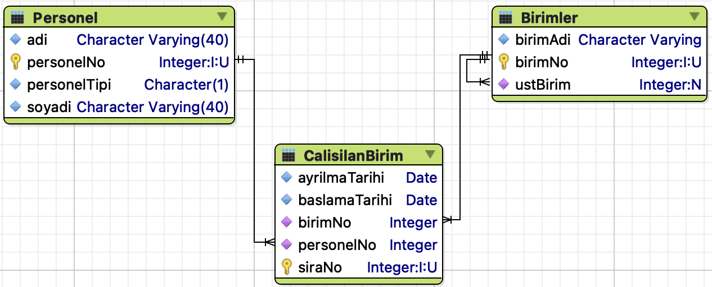
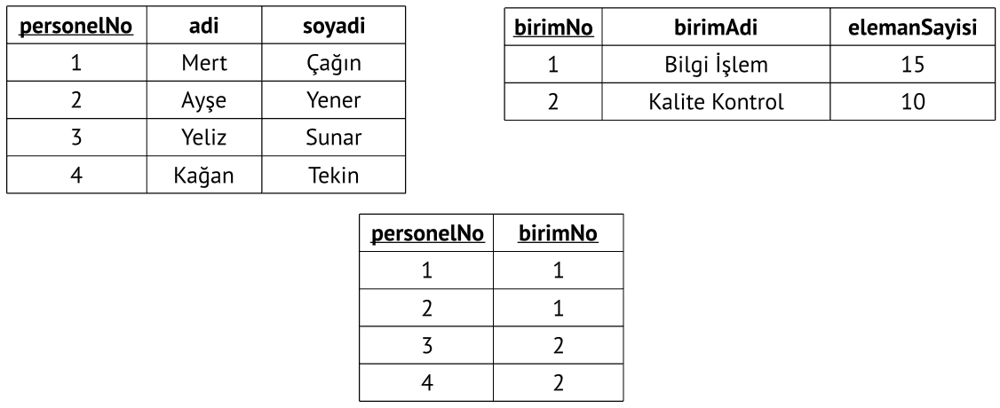
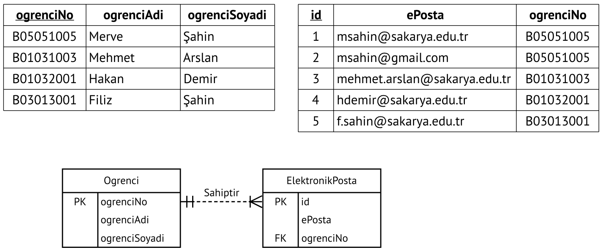
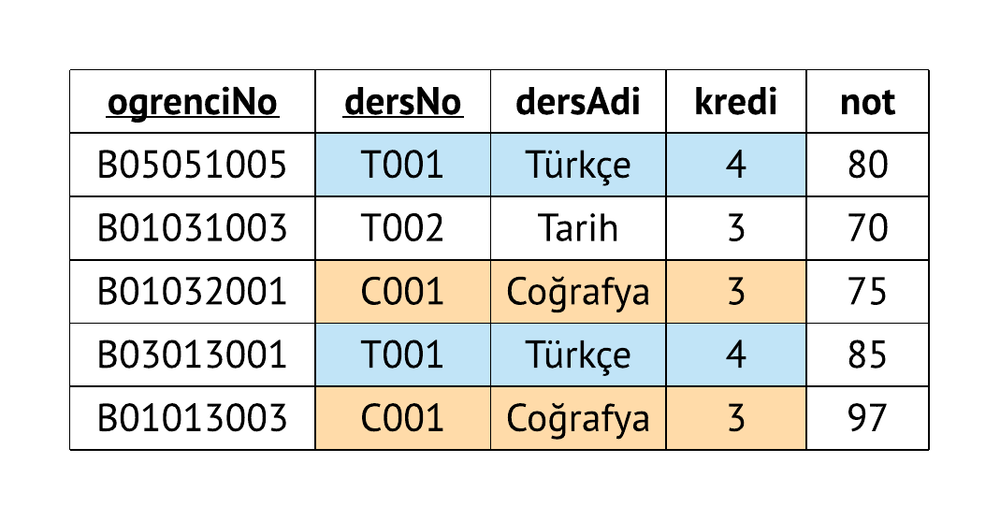
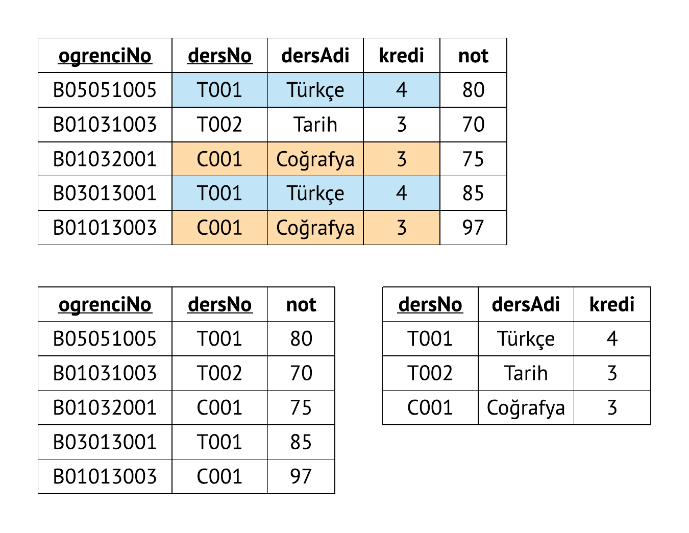
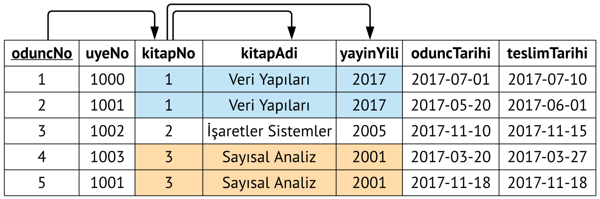
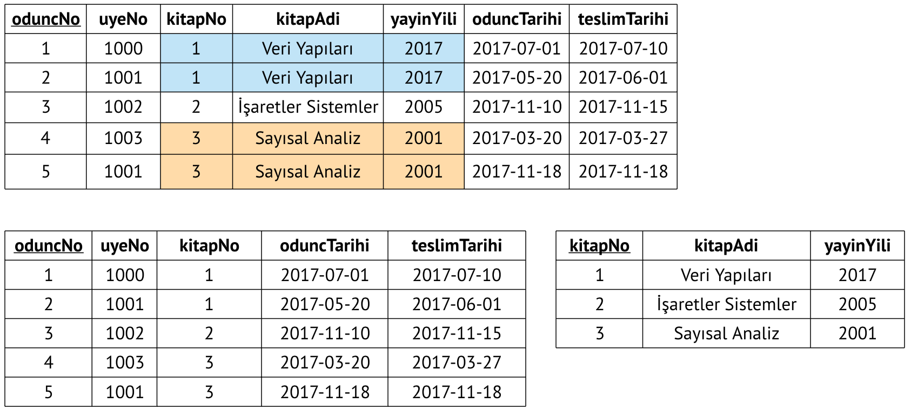

BSM211 Veritabanı Yönetim Sistemleri - Celal ÇEKEN, İsmail ÖZTEL, Veysel Harun ŞAHİN

# Normalizasyon

## Konular

* Normalizasyon
* Veri Tekrarının Zararları
* Birinci Normal Form (1NF)
* Fonksiyonel Bağımlılık
* İkinci Normal Form (2NF)
* Üçüncü Normal Form (3NF)
* 1., 2. ve 3. Normal Formlar
* Örnekler
* Kaynaklar

## Veritabanı Geliştirme Yaşam Döngüsü

## Normalizasyon

* İyi bir veritabanı tasarımı, düzenli ve sağlam tablo tasarımlarını gerektirir.

* Normalizasyon, veri fazlalıklarını en aza indirerek veri düzensizliklerinin (data anomaly) önüne geçebilmek için tablo yapılarını değerlendirme ve düzeltme işlemi olarak tanımlanabilir.

* Normalizasyon işlemi normal form adı verilen seri işlemlerden meydana gelir. 1NF, 2NF, 3NF, 4NF

* 2NF 1NF den, 3NF 2NF den, ve 4NF 3NF den daha iyidir.

* Her tasarım için en yüksek NF daha iyi sonuç verir denemez. Yüksek başarıma ihtiyaç duyulan bazı durumlarda normal formun (NF) düşürülmesi (denormalizasyon) gerekebilir.

* Örneğin yüksek hız için veri fazlalığı göze alınarak zaman zaman denormalizasyon yapılabilir.

* Normalizasyonun en temel faydası, **veri tekrarını** en aza indirerek veri düzensizliklerinin (data anomaly) önüne geçmemize yardımcı olmasıdır.

## Veri Tekrarının Zararları

> Veri tekrarı tablo içerisine başka tablonun gömüldüğü anlamına gelir.

* Veri tekrarında aynı bilgi defalarca kaydedilir.

* Veri tekrarı, kaynak kullanımında israfa yol açar.

* Veri tekrarı, veri tutarsızlıklarına (düzensizliklerine) neden olabilir.
    + Veri girişinde tutarsızlık
    + Veri güncellenmesinde tutarsızlık
    + Veri silmede tutarsızlık

### Veri Girişinde Tutarsızlık

* Veri tekrarı olan tablolara yeni kayıt eklenirken tutarsızlıklar oluşabilir.

> Tabloya yeni kayıt eklenirken birimAdi ve elemanSayisi sütunlarında tutarsızlık oluşmuştur.

* Veri tekrarı olan tablolara birincil anahtar değerinin tekrar etmesi durumunda yeni kayıt eklenemeyebilir.

> Tabloda, personelNo alanına değer yazılamaz ve 3 nolu birim eklenemez.

### Veri Güncellenmesinde Tutarsızlık

* Veri güncellenirken birçok noktada değişiklik yapmak gerekir ve bu durumda tutarsızlıklar oluşabilir.

> Tabloda elemanSayısı güncellenirken tutarsızlık oluşmuştur.

### Veri Silmede Tutarsızlık

* Veriler silinirken başka veriler de kaybedilebilir.

> Tabloda 1 numaralı birimin elemanları silindiğinde ilgili birimin bilgileri de kaybedilir.

### İyileştirilmiş Tasarım

## Birinci Normal Form (1NF)

* Bir tablonun birinci normal formda (1NF) olması için aşağıdaki şartlar sağlanmalıdır.

    + Tüm alanlar birincil anahtar tarafından belirlenebilmelidir.

    + Tüm alanlar tek değerli olmalıdır.

* Aşağıdaki tablo birinci normal formda (1NF) değildir.

    + Çünkü ePosta sütunu tek değerli değildir.

    + Normalizasyon yapmalıyız.

### Normalizasyon Sonucu

## Tekrarlanan Veri Grupları

* Aşağıdaki tablo birinci normal formdadır.

    + Tabloda birincil anahtar var.

    + Her sütunda tek değer var.

* Buna rağmen veri tekrarı vardır.

* Tablodaki tutarsızlık aşağıda gösterilmiştir.

## İkinci Normal Form (2NF)

### Fonksiyonel Bağımlılık

* Kayıtların ayırt edilebilmesi, tablolar arasında ilişki kurulabilmesini sağlar.
* Anahtarlar belirlenirken fonksiyonel bağımlılık göz önüne alınmalıdır.

* Aşağıdaki tabloda, ogrenciNo niteliği kullanılarak adi alanı belirlenebilir. (**tersi doğru değildir**)
* Bu durumda:
    + **ogrenciNo** alanı **adi** alanını **belirler**.
    + **adi** alanı, **ogrenciNo** alanına **fonksiyonel bağımlıdır ( ogrenciNo ➔ ogrenciAdi)**.

### Tam Fonksiyonel Bağımlılık

* Nitelikler birden fazla alanın birleşimine fonksiyonel bağımlı olabilir.
    + ogrenciNo, dersNo ➔ ortalama **Tam fonksiyonel bağımlılık**
    + ogrenciNo, dersNo ➔ dersAdi **Kısmi fonksiyonel bağımlılık**

### İkinci Normal Form Şartları

* Tablonun birinci normal formda olması gerekir.
* Birincil anahtar, birden fazla alanın birleşiminden oluşuyorsa, tablonun 2NF’de olabilmesi için diğer alanların birincil anahtara **tam fonksiyonel bağımlı** olması gerekir.
* Birincil anahtar tek alandan oluşuyorsa ve tablo 1NF’de ise, 2NF de sağlanmış olur.

### Örnek

* Birincil anahtar ogrenciNo ve dersNo alanlarından oluşan bileşik birincil anahtardır.
* not alanı birincil anahtara **tam fonksiyonel bağımlıdır**.
* dersAdi ve kredi alanları birincil anahtara **kısmi fonksiyonel bağımlıdır** ve bu nedenle tablo ikinci normal formda (2NF) değildir. Veri tekrarı meydana gelmiştir.

### Tabloyu 2NF'ye Dönüştürme (Kısmi Bağımlılıkların Giderilmesi)

## Üçüncü Normal Form (3NF)

### Geçişken Bağımlılık

* Eğer A ➔ B  ve  B ➔ C ise A ➔ B ➔ C  
    + A, B üzerinden C’yi belirler.
    + C, A ya geçişken bağımlıdır.

* Aşağıdaki tabloda geçişken bağımlılık vardır.
    + oduncNo ➔ ISBNNo ➔ kitapAdi
    + oduncNo ➔ ISBNNo ➔ yayinYili
    + oduncNo alanı, ISBNNo alanı üzerinden kitapAdi alanını belirler.
    + kitapAdi alanı, oduncNo alanına geçişken bağımlıdır.

### Üçüncü Normal Form Şartları

* Tablo 2NF’de ise ve geçişken bağımlılık yok ise 3NF’dedir.

### Tabloyu 3NF’ye Dönüştürme

### Özet

* 1NF: Birincil anahtar mevcuttur ve çok değerli alanlar yoktur.
* 2NF: Birinci normal formdadır ve kısmi bağımlılık yoktur.
* 3NF: İkinci normal formdadır ve geçişken bağımlılık yoktur.

### Örnek 1

* Tablodaki veri tekrarının nedenini ve nasıl düzeltilebileceğini açıklayınız.

### Örnek 2

* Tablodaki veri tekrarının nedenini ve nasıl düzeltilebilceğini açıklayınız.

